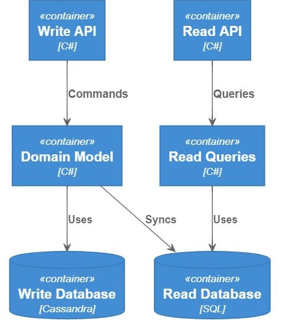
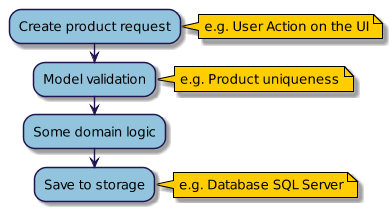
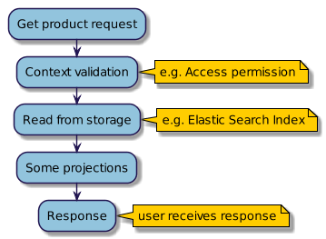

# CQRS w praktyce

Command/Query Responsibility Segregation a potocznie po prostu CQRS to wzorzec projektowy, który wprowawdza pewną segregację odpowiedzialności:



- rozkazów (ang. *commands*) – dla operacji które modyfikują dane
- zapytań (ang. *queries*) – dla operacji które odczytują dane

W procesie zapisu zazwyczaj mamy walidację danych, dodatkową logikę domenową, a wreszcie zapis może być do zupełnie innych systemów danych niż odczyt (np. baza obiektowa – zapis, baza relacyjna – odczyt). Modele (struktury) wyglądają inaczej – np. przy zapisie posługujemy się identyfikatorami, a przy odczycie nazwami, możemy też pobierać np. dodatkowe dane audytowe. Wreszcie proces odczytu zazwyczaj zoptymalizowany jest pod zupełnie inne kryteria niż zapis, różne też mogą być wymagania biznesowe – w jednym przypadku chcemy mieć efektywny odczyt (miliony requestów), zapis jest sporadyczny, a w innym przypadku szczególny nacisk chcemy położyć na szybkość zapisu, a odczyt jest bardzo nieregularny. Z powodu tych różnic CQRS zakłada, że te operacje powinny być odseparowane.

Przykładowe procesy zapisu oraz odczytu danych i ich różnice zostały to zilustrowane na poniższych diagramach:

Proces zapisu danych ( CQRS Command )



Proces odczytu danych ( CQRS Query )



## Kontekst biznesowy

Na potrzeby przykładu, założmy, że stoimy przed zadaniem zamodelowania wycinka pewnej domeny, zorientowanej wokół produktu.

### Wymaganiami biznesu jest:

- tworzyć nowe produkty (model: id, name)
- wyświetlać istniejące produkty (klucz: id)
- informacja o tym kto utworzył produkt
- rozwiązanie powinno być bardzo efektywne (do odczytu zastosujemy silnik wyszukiwania np. ElasticSearch – zamiast bazy danych)
- sprawdzać dostępność produktu (klucz: id)
- dostępność będzie dostarczana przez zewnętrzny provider
- operacja jest dosyć kosztowna, więc jest dostępna na żądanie (zamiast każdorazowo podczas wyświetlania produktu)
powinna być zawsze aktualna więc odrzucamy od razu ewentualną spójność (ang. Eventual consistency)

Na tym etapie nie znamy więcej wymagań.

## Implementacja bez CQRS-a
Na początku zaprezentuję klasyczną implementację w oparciu o serwisy, następnie zrefaktorujemy kod do wzorca CQRS aby lepiej zobrazować różnice na konkrentym przykładzie.

Przystępujemy więc klasycznie do modelowania wejścia do domeny produktu. Wstępnie decydujemy, że jeden duży serwis zagreguje wszystkie trzy odpowiedzialności: tworzenie, wyświetlanie oraz dostępność produktu. Powstanie więc serwis ProductService oraz dwa modele CreateProduct i Product.

```
class ProductService
{
    IProductAvailabilityProvider ProductAvailabilityProvider;
    IWriteStorageProvider WriteStorageProvider;
    IReadIndexProvider ReadIndexProvider;

    Create(CreateProduct product)
    {
        // validation
        // domain logic
        // save to storage (WriteStorageProvider)
    }

    Product Get(string id)
    {
      // read from storage (ReadIndexProvider)
      // projection
    }

    bool IsAvailable(string id)}
    {
        // read from external provider (ProductAvailabilityProvider)
    }
}

class CreateProduct
{
    string Id { get; }
    string Name { get; }
}

class Product : CreateProduct
{
    string Creator { get; }
}
```

### Problemy

Spoktykamy się tutaj z kilkoma problemami:

- wiele odpowiedzialności serwisu (tworzenie, wyświetlanie, sprawdzanie dostępności), złamane (ang. Single Responsibility Principle)
- wiele zależności serwisu (ang. coupling) – do providera zapisu, do providera odczytu, do providera który sprawdza dostępność
- każdorazowe wstrzykiwanie wszystkich zależności np. do kontrolera API który tylko wyświetla produkt
- zmiany w części serwisu mogą powodować konieczność poprawy wszystkich testów jednostkowych związanych z tym serwisem (można to obejść stosując auto-wstrzykiwanie zależności w testach)

### Refaktoryzacja

Spróbujmy poprawić nasz serwis, żeby pozbyć się powyższych mankamentów:

- rozbicie na mniejsze serwisy, tak aby każdy z nich miał jedną odowiedzialność oraz mniej zależności

Grupując je na dwa typy gdzie kryterium będzie rodzaj operacji na danych:
- serwisy które modyfikują dane
- serwisy które odczytują dane


#### Modyfikacja danych

`ProductCreationService` – będzie odpowiedzialny za tworzenie produktów:

```
class ProductCreationService
{
    IWriteStorageProvider WriteStorageProvider;

    Create(CreateProduct product)
    {
        // validation
        // domain logic
        // save to storage (WriteStorageProvider)
    }
}
```

#### Odczyt danych

`ProductAvailabilityService` – będzie odpowiedzialny za sprawdzanie dostępności produktów
```
class ProductAvailabilityService
{
    IProductAvailabilityProvider ProductAvailabilityProvider;

    bool IsAvailable(string id)
    {
        // read from external provider (ProductAvailabilityProvider)
    }
}
```

`ProductProjections` – będzie odpowiedzialny za projekcje produktów na potrzeby różnych widoków.

```
class ProductProjections
{
  IReadIndexProvider ReadIndexProvider;

  Product Get(string id)
  {
    // read from storage (ReadIndexProvider)
    // some projection
  }
}
```

### Refaktoryzacja do CQRS

Skoro mamy już pogrupowane serwisy wg kryterium odczyt i zapis danych, zrefaktorujmy je na Commands oraz Queries.

```
class CreateProduct : Command
{
    CreateProduct(string id, string name);

    string Id { get; }
    string Name { get; }
}

class CreateProductHandler : CommandHandler<CreateProduct>
{
    IWriteStorageProvider WriteStorageProvider;

    void Handle(CreateProduct command)
    {
      // validation
      // domain logic
      // save to storage (WriteStorageProvider)
    }
}


class IsProductAvailable : Query<bool>
{
    IsProductAvailable(string id);

    string Id { get; }
}

class IsProductAvailableHandler : QueryHandler<IsProductAvailable, bool>
{
    IProductAvailabilityProvider ProductAvailabilityProvider;

    bool Handle(IsProductAvailable query)
    {
       // reads from ProductAvailabilityProvider
    }
}

class GetProduct : Query<Product>
{
   GetProduct (string id);
}

class GetProductHandler : QueryHandler<GetProduct, Product>
{
   IReadIndexProvider ReadIndexProvider;

  Product Handle(GetProduct query)
  {
     // read from storage (ReadIndexProvider)
     // projection
  }
}
```

Model *CreateProduct* stał się komendą, a serwis *ProductCreationService* stał się handlerem dla tej komendy. 
Serwis *ProductAvailabilityService* oraz *ProductProjections* zostały przekształcone w query *IsProductAvailable* oraz *GetProduct*.

### Konkluzja
Przykład z naszej domeny potwierdza, że:

- Model zapisu jest inny niż model odczytu
- Walidacja po stronie zapisu danch nie występuje przy operacjach odczytu
- Operacje zapisu są całkiem agnostyczne od odczytu – zapis bezpośrednio do bazy danych, a odczyt z indeksu
- Projekcje – różne ujęcia odczytu danych, grupowanie, itp będę powodowały konieczność tworzenia nowych modeli

### Jakie są zyski?
Z CQRSem wiąże się wzorzec mediatora – dla command i query dostarczamy jednolite interfejsy, a command i query wykonujemy poprzez instancję mediatora. Zmniejsza to *coupling* pomiędzy obiektami, ponieważ wiedzą one tylko o instancji mediatora.

Zatem powyższe wywołania zamiast wyglądać tak: `CreateProductHandler(new CreateProduct())` mogą wyglądać tak: `Mediator.Send(new CreateProduct())`.

Kolejnym zyskiem jest łatwość testowania poszczególnych command i query. Dostarczamy tylko niezbęne zależności i testujemy jedną odpowiedzialność w ramach danego command/query.

### Kiedy CQRS nie jest najlepszym pomysłem?

CQRS jak wszystko ma swoje wady, np. wprowadza dodatkową złożoność. Zatem wszędzie tam gdzie mamy systemy tpu CRUD pchanie na siłę CQRS nie ma wg mnie sensu. Zależnie od przyjętej konwencji organizacji kodu, może wprowadzać dodatkowe zamieszenie – na początek zalecałbym stosowanie konwencji: komenda/query i handler w tym samym pliku.

### Przykład implementacji
.NET – [MediatR](https://github.com/jbogard/MediatR)
